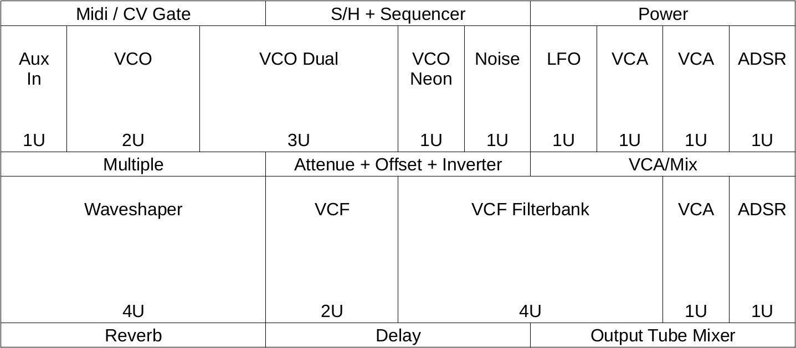
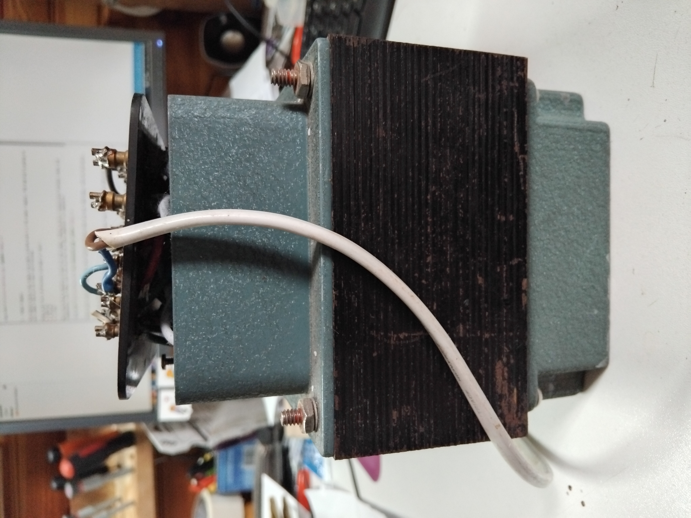
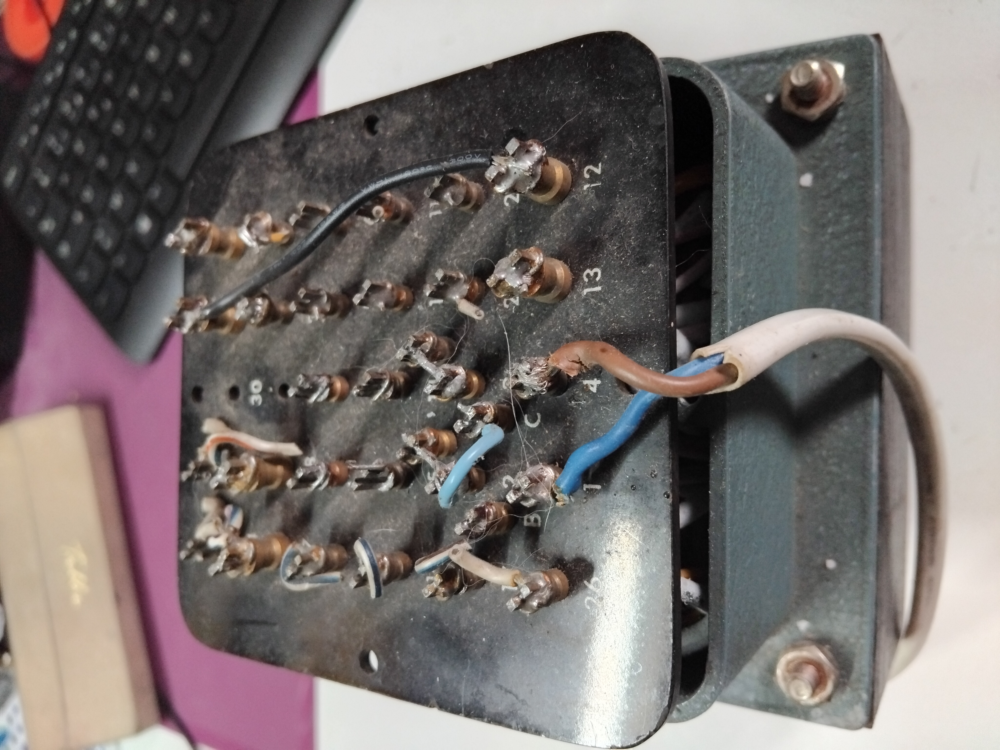

# Tube_Synth_About

5U vacuum tube modular synth.
What a strange idea... ^^

## 1 - the context : 

I met up again with a friend (JM) who will soon be retired and who has been a tube amp enthusiast for a very long time.
He repairs them, makes them, modifies them and so on.

Now we see each other from time to time, we chat, he comes to my home studio, I go to his place, we chat, we have a laugh, we exchange components and tips.

And then, one day he says to me: "How would you like to make a tube modular" :o
... uh yes ... I say to him with a drop of sweat starting to bead on my forehead :D

I dream about it at night now ... ^^

**First of all, I'd like to extend my warmest thanks to Eric Barbour (https://www.metasonix.com/), Rene Schmitz (https://www.schmitzbits.de/), Marc Bareille (http://m.bareille.free.fr/index.htm), Sam Battle (https://www.lookmumnocomputer.com/) and Ken Stone (https://open4umodular.github.io/synthpanel/) Disaster electric : (https://www.disasterelectric.com/) all the Synth DIYer ... for sharing their schemas and knowledge.**

**But also my dear JM, without whom this project would not be possible.**

## 2 - Format and size

We decided to go for 5U - DotCom, as we're going to be using lamps requiring a high power supply (up to 150V), so we'd be stuck with 3U Euro skiff friendly ;)

And so the 6.35mm jacks of circumstance.

The box will be 12U wide, i.e. 648mm
I'd like to put 2 rows of 5U high and 3 rows of 1U high for utilities that will work without tubes.

Here you'll see the modules in place

## 3 - Power Supply 

The master piece that makes the whole system work is the power supply. The one we're going to use comes from an old tube oscilloscope.

There will be 3 differents voltage at least :
* 150V DC
* 6.3V AC
* +/-15V

I'll be sure to make a documentation to find the right voltages with this kind of material. :)

## 4 - Modules

Here's the list of planned modules, but changes can always be made until the synth is finished :D

To be continued...

### With Tubes :

* AUX IN with the help of a VCA Metasonix - https://sdiy.info/wiki/Audio_synthesis_via_vacuum_tubes/Tube_VCA

Tube = EF86

* VCO Néon René Schmitz - https://www.schmitzbits.de/vtvco.html

Tubes = Neon Lamp and 12AX7

* VCO René Schmitz - https://www.schmitzbits.de/vtvco2.html

Tubes = 2D21 and 6N16B

* VCO Dual Metasonix - https://sdiy.info/wiki/Audio_synthesis_via_vacuum_tubes/Metasonix_TS-23_dual_VCO

Tubes = 6AL5, 2 x 2D21 and 6BN6

* VCF Low Pass René Schmitz - https://www.schmitzbits.de/vtvcf.html

Tubes = 6N1P and EF86

* VCF Filterbank Metasonix - https://sdiy.info/wiki/Audio_synthesis_via_vacuum_tubes/Metasonix_TS-22_pentode_filterbank

Tubes = 6AL5 and 5 x 6AK5

* NOISE CGS - https://sdiy.info/wiki/CGS_tube_noise_source

Tubes = 2D21 and 12AX7

* VCA René Schmitz - https://www.schmitzbits.de/vtvca.html

Tubes = 3 x 6J1B and 6N16B

* VCA Lmnc - https://www.lookmumnocomputer.com/valve-distorting-vca

Tubes = 12AX7

* WAVESHAPER Metasonix - https://sdiy.info/wiki/Audio_synthesis_via_vacuum_tubes/Metasonix_TS-21_hellfire_modulator

Tubes = AL5, 6AK5, 2 x 6AQ8 and 6AR8

* RING MOD - No schema found for the moment

### Without Tubes :

Github is full of schemes I've never tried before... When that's all that's left, the hard part will be over.

* MULTIPLE x 1 actif et passif

* MIXER x 1 + VCA/Mixer x 1

* LFO x 1

* AttOff x 1 (Atténuateur, atténuverteur, offset)

* ADSR x 2

* REVERB x 1 + Delay x 1

* POWER x 1

* S/H + Seq x 1

## 5 - Where can I find the tubes I need ?

I found this French site that lists a quantity of lamps that I never imagined...

What's more, it's only 100km from my home ^^

https://www.vintelec.com/

Or an old Russian factory : https://tubes-store.com/

## 6 - Further readings

* https://blog.boozhoundlabs.com/a-vacuum-tube-hi-fi-primer-979678e829eb

* https://www.circuitbread.com/textbooks/lessons-in-electric-circuits-volume-vi-experiments/discrete-semiconductor-circuits/vacuum-tube-audio-amplifier

* https://www.tropicalfishvintage.com/blog/2019/7/4/on-vacuum-tube-heaters

* https://oestex.com/tubes/wiring.html

* https://www.tubesandmore.com/products/saga-vacuum-tube-history

* http://www.geofex.com/article_folders/stargnd/stargnd.htm

* https://www.disasterelectric.com/
